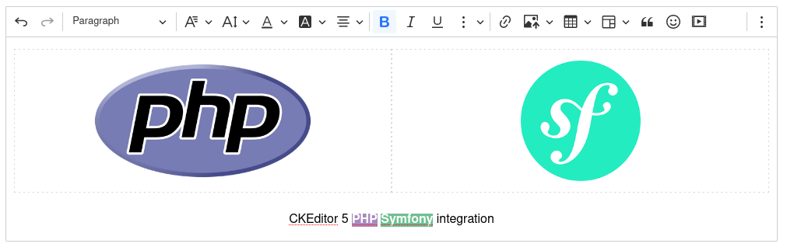

# ckeditor5-symfony

[](LICENSE)
[](http://makeapullrequest.com)

[](https://github.com/Mati365/ckeditor5-symfony/issues)
[](https://app.codecov.io/gh/Mati365/ckeditor5-symfony/tree/main/npm_package%2Fsrc)
[](https://app.codecov.io/gh/Mati365/ckeditor5-symfony/tree/main/src)


CKEditor 5 for Symfony >=6.4.x — a lightweight WYSIWYG editor integration for Symfony. Easy to set up, it supports custom builds, dynamic loading, and localization. The package includes JavaScript and CSS assets, making it simple to integrate CKEditor 5 into your Symfony applications.

> [!IMPORTANT]
> This integration is unofficial and not maintained by CKSource. For official CKEditor 5 documentation, visit [ckeditor.com](https://ckeditor.com/docs/ckeditor5/latest/). If you encounter any issues in editor, please report them on the [GitHub repository](https://github.com/ckeditor/ckeditor5/issues).

<p align="center">
  
</p>

## Table of Contents

- [ckeditor5-symfony](#ckeditor5-symfony)
  - [Table of Contents](#table-of-contents)
  - [Installation 🚀](#installation-)
  - [Usage 📖](#usage-)
  - [Basic Usage 🏁](#basic-usage-)
    - [Simple Editor ✏️](#simple-editor-️)
    - [Watchdog prop 🐶](#watchdog-prop-)
      - [Disabling the watchdog 🚫](#disabling-the-watchdog-)
  - [Editor Types 🖊️](#editor-types-️)
    - [Classic editor 📝](#classic-editor-)
    - [Multiroot editor 🌳](#multiroot-editor-)
    - [Inline editor 📝](#inline-editor-)
    - [Decoupled editor 🌐](#decoupled-editor-)
  - [Forms Integration 🧾](#forms-integration-)
    - [Symfony Form Type 🧑‍💻](#symfony-form-type-)
  - [Configuration ⚙️](#configuration-️)
    - [Custom Presets 🧩](#custom-presets-)
    - [Dynamic configuration 🎯](#dynamic-configuration-)
    - [Providing the License Key 🗝️](#providing-the-license-key-️)
    - [Referencing DOM Elements in Config 🏷️](#referencing-dom-elements-in-config-️)
      - [How to use 🛠️](#how-to-use-️)
      - [Example 📄](#example-)
  - [Localization 🌍](#localization-)
    - [CDN Translation Loading 🌐](#cdn-translation-loading-)
      - [AssetsMapper local translations assignment 📦](#assetsmapper-local-translations-assignment-)
      - [Global CDN translation loading ☁️](#global-cdn-translation-loading-️)
    - [Global Translation Config 🛠️](#global-translation-config-️)
      - [AssetsMapper translations installation 📥](#assetsmapper-translations-installation-)
      - [Direct CDN translations configuration ⚙️](#direct-cdn-translations-configuration-️)
    - [Custom translations 🌐](#custom-translations-)
  - [Custom plugins 🧩](#custom-plugins-)
  - [Context 🤝](#context-)
    - [Basic usage 🔧](#basic-usage--1)
    - [Custom context translations 🌐](#custom-context-translations-)
  - [Watch registered editors 👀](#watch-registered-editors-)
    - [Wait for particular editor to be registered ⏳](#wait-for-particular-editor-to-be-registered-)
  - [Installer command options ⚙️](#installer-command-options-️)
  - [Development ⚙️](#development-️)
    - [Running Tests 🧪](#running-tests-)
  - [Psst... 👀](#psst-)
  - [Trademarks 📜](#trademarks-)
  - [License 📜](#license-)

## Installation 🚀

1. **Install the package:**

   ```bash
   composer require mati365/ckeditor5-symfony
   ```

2. **Enable the bundle:**

   ```php
   // config/bundles.php

   return [
     // ...
     Mati365\CKEditor5Symfony\CKEditorBundle::class => ['all' => true],
   ];
   ```

3. **Run the installer:**

   Choose the distribution method that best fits your needs:

   **🏠 Self-hosted (Recommended)**
   Bundles assets locally. No Node.js required.

   ```bash
   php bin/console ckeditor5:assets-mapper:install
   ```

   **📡 CDN Distribution**
   Loads assets from CKSource CDN.

   ```bash
   php bin/console ckeditor5:assets-mapper:install --distribution=cloud
   ```

   _For CDN, add `CKEDITOR5_LICENSE_KEY="your-key"` to your `.env` file._

   > 💡 **Tip:** Add `--premium` to either command to install premium features (requires a valid license).

   For more options, see [Installer command options](#installer-command-options-️).

## Usage 📖

To use CKEditor 5 in your Twig templates, simply call the `cke5_editor()` function:

```twig
{{ cke5_editor('Your content here') }}
```

If you don't use `AssetsMapper`, and your distribution is set to `cloud`, make sure to include the assets using `cke5_cloud_assets()` in your `<head>` section.

```twig
{{ cke5_cloud_assets() }}
```

This will render a classic editor with the provided content.
For more advanced usage, check the playground examples.

## Basic Usage 🏁

Get started with the most common usage patterns. These examples show how to render editors in your templates.

### Simple Editor ✏️

Create a basic editor with default toolbar and features.

```twig
{{ cke5_editor(
  content: '<p>Initial content</p>',
  editorType: 'classic',
  editableHeight: 300
) }}
```

### Watchdog prop 🐶

By default, the editor uses a built-in watchdog mechanism to automatically restart the editor if it crashes (e.g., due to a JavaScript error). The watchdog periodically saves the editor's content and restores it after a crash, minimizing the risk of data loss for users.

#### Disabling the watchdog 🚫

The watchdog is enabled by default. To disable it, set the `watchdog` argument to `false`:

```twig
{{ cke5_editor(
  content: '<p>Initial content</p>',
  editorType: 'classic',
  watchdog: false
) }}
```

## Editor Types 🖊️

CKEditor 5 Symfony supports four distinct editor types, each designed for specific use cases. Choose the one that best fits your application's layout and functionality requirements.

### Classic editor 📝

Traditional WYSIWYG editor with a fixed toolbar above the editing area. Best for standard content editing scenarios like blog posts, articles, or forms.


```twig
{{ cke5_editor(
  content: '<p>Initial content here</p>',
  editorType: 'classic',
  editableHeight: 300
) }}
```

### Multiroot editor 🌳

Advanced editor supporting multiple independent editable areas within a single editor instance. Perfect for complex layouts like page builders, newsletters, or multi-section content management.


```twig
{# Editor container #}
{{ cke5_editor(editorType: 'multiroot') }}

{# Shared toolbar #}
{{ cke5_ui_part('toolbar') }}

{# Multiple editable areas #}
<div class="row">
  <div class="col">
    <h2>Header</h2>
    {{ cke5_editable(rootName: 'header', content: 'Header content', class: 'border') }}
  </div>
  <div class="col">
    <h2>Content</h2>
    {{ cke5_editable(rootName: 'content', content: 'Main content', class: 'border') }}
  </div>
</div>
```

### Inline editor 📝

Minimalist editor that appears directly within content when clicked. Ideal for in-place editing scenarios where the editing interface should be invisible until needed.


```twig
{{ cke5_editor(
  content: '<p>Click here to edit this content</p>',
  editorType: 'inline',
  editableHeight: 300
) }}
```

**Note:** Inline editors don't work with `<textarea>` elements and may not be suitable for traditional form scenarios.

### Decoupled editor 🌐

Flexible editor where toolbar and editing area are completely separated. Provides maximum layout control for custom interfaces and complex applications.


```twig
{# Decoupled editor container #}
{{ cke5_editor(id: 'decoupled-editor', editorType: 'decoupled') }}

<div class="editor-container">
  {# Toolbar can be placed anywhere #}
  {{ cke5_ui_part('toolbar') }}

  {# Editable area with custom styling #}
  {{ cke5_editable(
    content: '<p>Initial content here</p>',
    class: 'border p-4 rounded',
    editableHeight: 300
  ) }}
</div>
```

## Forms Integration 🧾

Seamlessly integrate CKEditor 5 with Symfony Forms. The bundle provides a `CKEditor5Type` that facilitates easy integration.

### Symfony Form Type 🧑‍💻

Use `CKEditor5Type` in your form class to render the editor.

```php
use Mati365\CKEditor5Symfony\Form\Type\CKEditor5Type;
// ...

$builder->add('content', CKEditor5Type::class, [
  'label' => 'Article Content',
  'required' => true,
  'attr' => ['row_attr' => ['class' => 'text-editor']],
]);
```

Then in your template:

```twig
{{ form_row(form.content) }}
```

The editor automatically synchronizes its content with the underlying hidden input field upon form submission.

## Configuration ⚙️

You can configure the editor _presets_ in your `config/packages/ckeditor5.yaml` file. The default preset is `default`, which provides a basic configuration with a toolbar and essential plugins. The preset is a map that contains the editor configuration, including the toolbar items and plugins. There can be multiple presets, and you can switch between them by passing the `preset` keyword argument to the `cke5_editor` function.

### Custom Presets 🧩

In order to override the default preset or add custom presets, you can add the following configuration:

```yaml
# config/packages/ckeditor5.yaml

ckeditor5:
  presets:
    minimal:
      editorType: classic
      config:
        toolbar: [bold, italic, link]
        plugins: [Bold, Italic, Link, Essentials, Paragraph]

      # Only if don't use AssetsMapper and using cloud distribution. Otherwise, this section is ignored,
      # as it's automatically configured during `ckeditor5:assets-mapper:install` command.
      cloud:
        version: 46.0.0
        premium: true
        translations: [pl]
        ckbox:
          version: 1.0.0

    full:
      editorType: classic
      config:
        toolbar:
          - heading
          - '|'
          - bold
          - italic
          - underline
          - '|'
          - link
          - insertImage
          - insertTable
          - '|'
          - bulletedList
          - numberedList
          - blockQuote
        plugins:
          - Heading
          - Bold
          - Italic
          - Underline
          - Link
          - ImageBlock
          - ImageUpload
          - Table
          - List
          - BlockQuote
          - Essentials
          - Paragraph
```

In template:

```twig
{{ cke5_editor(content: '<p>Simple editor</p>', preset: 'minimal') }}
```

### Dynamic configuration 🎯

You can also override configuration at runtime by passing `config` or `mergeConfig` arguments to the editor function. This is useful if you want to change the editor configuration based on user input or other conditions.

```twig
{# Override configuration (shallow merge) #}
{{ cke5_editor(
    content: 'Content',
    config: { 'toolbar': ['bold', 'italic'] }
) }}

{# Merge configuration (deep merge) #}
{{ cke5_editor(
    content: 'Content',
    mergeConfig: { 'toolbar': { 'items': ['bold'] } }
) }}
```

### Providing the License Key 🗝️

CKEditor 5 requires a license key when using the official CDN or premium features. You can provide the license key in two simple ways:

1. **Environment variable**: Set the `CKEDITOR5_LICENSE_KEY` environment variable in your `.env` file. This is the easiest and most common way.
2. **Preset config**: You can also set the license key directly in your preset configuration in `config/packages/ckeditor5.yaml`:

   ```yaml
   ckeditor5:
     presets:
       default:
         licenseKey: your-license-key-here
   ```

If you use CKEditor 5 under the GPL license, you do not need to provide a license key. However, if you choose to set one, it must be set to `GPL`.

If both are set, the preset config takes priority. For more details, see the [CKEditor 5 licensing guide](https://ckeditor.com/docs/ckeditor5/latest/getting-started/licensing/license-and-legal.html).

### Referencing DOM Elements in Config 🏷️

You can reference DOM elements directly in your editor configuration using the special `{ $element: "selector" }` format. This is useful when you want to attach the editor's UI parts (like toolbars or editable areas) to specific elements in your HTML.

#### How to use 🛠️

- In your config object, use `{ "$element": "CSS_SELECTOR" }` wherever a DOM element is expected.
- The selector will be resolved to the actual DOM element before initializing the editor.

#### Example 📄

```yaml
# config/packages/ckeditor5.yaml

ckeditor5:
  presets:
    # ... other presets
    minimal:
      config:
        # ... other config
        yourPlugin:
          toolbar: {$element: '#my-toolbar'}
          editable: {$element: '#my-editable'}
```

This will find the elements with IDs `my-toolbar` and `my-editable` in the DOM and use them for the editor's UI.

⚠️ If the element is not found, a warning will be shown in the console.

## Localization 🌍

Support multiple languages in the editor UI and content. Learn how to load translations via CDN or configure them globally.

### CDN Translation Loading 🌐

Depending on your setup, you can preload translations via CDN.

#### AssetsMapper local translations assignment 📦

If you want to load a specific language for the editor UI, you can specify the `language` argument in the `cke5_editor()` function:

```twig
{{ cke5_editor(
    language: 'pl',
    content: '<p>Content in English, UI in Polish</p>'
) }}
```

Remember, that this only works if you have installed the translations using the `ckeditor5:assets-mapper:install` command with the `--translations` option.

```bash
php bin/console ckeditor5:assets-mapper:install --translations=pl,de,fr
```

#### Global CDN translation loading ☁️

If you don't use `AssetsMapper`, you can load translations directly from CDN by specifying them in the preset config or during installation. See [Global Translation Config](#global-translation-config-️) for more details.

If you want to specify it in the template,you can use `cke5_cloud_assets()` function:

```twig
{# It'll load translations for Polish, German, and French from CDN #}
{{ cke5_cloud_assets(translations: ['pl', 'de', 'fr']) }}
```

### Global Translation Config 🛠️

#### AssetsMapper translations installation 📥

You can fetch translations globally by specifying them in the `ckeditor5:assets-mapper:install` command:

```bash
php bin/console ckeditor5:assets-mapper:install --translations=pl,de,fr
```

#### Direct CDN translations configuration ⚙️

You can also configure translations globally in your configuration file. This is useful if you want to load translations for multiple languages at once or set a default language for the editor. Keep in mind that this configuration is only used when loading translations via CDN. If you are using self-hosted setup, translations are handled by your bundler automatically.

```yaml
# config/packages/ckeditor5.yaml

ckeditor5:
  presets:
    default:
      cloud:
      translations: [pl, de, fr]
```

**Note:** For self-hosted setups, translations are handled by your bundler automatically.

### Custom translations 🌐

You can also provide custom translations for the editor. This is useful if you want to override existing translations or add new ones. Custom translations can be provided in the preset configuration.

```yaml
# config/packages/ckeditor5.yaml

ckeditor5:
  presets:
    default:
      customTranslations:
        en:
          Bold: Custom Bold
          Italic: Custom Italic
        pl:
          Bold: Pogrubiony
          Italic: Kursywa
```

## Custom plugins 🧩

To register a custom plugin, use the `CustomEditorPluginsRegistry`.

```javascript
import { CustomEditorPluginsRegistry as Registry } from '@mati365/ckeditor5-symfony';

const unregister = Registry.the.register('MyCustomPlugin', async () => {
  // It's recommended to use lazy import to
  // avoid bundling ckeditor code in your application bundle.
  const { Plugin } = await import('ckeditor5');

  return class extends Plugin {
    static get pluginName() {
      return 'MyCustomPlugin';
    }

    init() {
      console.log('MyCustomPlugin initialized');
      // Custom plugin logic here
    }
  };
});
```

In order to use the plugin you need to extend your config in `config/packages/ckeditor5.yaml`:

```yaml
ckeditor5:
  presets:
    default:
      config:
        plugins: [MyCustomPlugin, Essentials, Paragraph]
        # ... other config options
```

It must be called before the editor is initialized. You can unregister the plugin later by calling the returned function:

```javascript
unregister();
// or CustomEditorPluginsRegistry.the.unregister('MyCustomPlugin');
```

If you want to de-register all registered plugins, you can use the `unregisterAll` method:

```javascript
import { CustomEditorPluginsRegistry } from '@mati365/ckeditor5-symfony';

CustomEditorPluginsRegistry.the.unregisterAll();
```

## Context 🤝

The **context** feature is designed to group multiple editor instances together, allowing them to share a common context. This is particularly useful in collaborative editing scenarios, where users can work together in real time. By sharing a context, editors can synchronize features such as comments, track changes, and presence indicators across different editor instances. This enables seamless collaboration and advanced workflows in your application.

For more information about the context feature, see the [CKEditor 5 Context documentation](https://ckeditor.com/docs/ckeditor5/latest/features/collaboration/context-and-collaboration-features.html).


### Basic usage 🔧

Define your context in configuration:

```yaml
ckeditor5:
  contexts:
    your_context:
      config:
        plugins:
          - CustomContextPlugin
      watchdogConfig:
        crashNumberLimit: 20
```

And use it in your template:

```twig
{# Initialize context #}
{{ cke5_context(id: 'shared-context', contextPreset: 'your_context') }}

{# Connect editors to context #}
{{ cke5_editor(content: 'Child A', contextId: 'shared-context') }}
{{ cke5_editor(content: 'Child B', contextId: 'shared-context') }}
```

Voila!

### Custom context translations 🌐

Define your custom translations in the configuration:

```yaml
ckeditor5:
  contexts:
    custom:
      # ...
      customTranslations:
        en:
          Bold: Custom Bold
          Italic: Custom Italic
        pl:
          Bold: Pogrubiony
          Italic: Kursywa
```

These translations will be used in the context's editors, overriding the default translations. They are available through `locale.t` plugin in every context plugin.

## Watch registered editors 👀

You can watch the registered editors using the `watch` function. This is useful if you want to react to changes in the registered editors, for example, to update the UI or perform some actions when an editor is added or removed.

```javascript
import { EditorsRegistry } from '@mati365/ckeditor5-symfony';

const unregisterWatcher = EditorsRegistry.the.watch((editors) => {
  console.log('Registered editors changed:', editors);
});

// Later, you can unregister the watcher
unregisterWatcher();
```

### Wait for particular editor to be registered ⏳

You can also wait for a specific editor to be registered using the `waitForEditor` function. This is useful if you want to perform some actions after a specific editor is registered.

This method can be called before the editor is initialized, and it will resolve when the editor is registered.

```javascript
import { EditorsRegistry } from '@mati365/ckeditor5-symfony';

EditorsRegistry.the.waitFor('editor1').then((editor) => {
  console.log('Editor "editor1" is registered:', editor);
});

// ... init editor somewhere later
```

The `id` of the editor must be used to identify the editor. If the editor is already registered, the promise will resolve immediately.

## Installer command options ⚙️

The `ckeditor5:assets-mapper:install` command supports the following options:

```bash
php bin/console ckeditor5:assets-mapper:install --help

Description:
  Configure CKEditor5 assets in importmap.php, update base template, and download CKEditor to assets/vendor for cloud or NPM distribution

Usage:
  ckeditor5:assets-mapper:install [options]

Options:
      --distribution=DISTRIBUTION      Distribution type: cloud or npm [default: "npm"]
      --importmap-path=IMPORTMAP-PATH  Path to importmap.php file [default: "importmap.php"]
      --editor-version=EDITOR-VERSION  CKEditor version [default: "47.3.0"]
      --translations=TRANSLATIONS      Comma-separated list of translations [default: "en"]
      --template-path=TEMPLATE-PATH    Path to base template file [default: "templates/base.html.twig"]
      --js-path=JS-PATH                Path to main JS file [default: "assets/app.js"]
      --css-path=CSS-PATH              Path to main CSS file [default: "assets/styles/app.css"]
      --ckbox-version[=CKBOX-VERSION]  CKBox version
      --ckbox-theme[=CKBOX-THEME]      CKBox theme (light or dark)
      --premium                        Include premium features
      --skip-template-update           Skip updating the Twig template
      --skip-composer-update           Skip updating composer.json
      --skip-css-update                Skip updating CSS imports
      --skip-js-update                 Skip updating Jng composer.json
  -h, --help                           Display help for the given command. When no command is given display help for the list command
      --silent                         Do not output any message
  -q, --quiet                          Only errors are displayed. All other output is suppressed
  -V, --version                        Display this application version
      --ansi|--no-ansi                 Force (or disable --no-ansi) ANSI output
  -n, --no-interaction                 Do not ask any interactive question
  -e, --env=ENV                        The Environment name. [default: "dev"]
      --no-debug                       Switch off debug mode.
      --profile                        Enables profiling (requires debug).
  -v|vv|vvv, --verbose                 Increase the verbosity of messages: 1 for normal output, 2 for more verbose output and 3 for debug
```

## Development ⚙️

To start the development environment, run:

```bash
pnpm run dev
```

The playground app will be available at [http://localhost:8000](http://localhost:8000).

### Running Tests 🧪

The project includes comprehensive PHP unit tests with 100% code coverage requirement:

```bash
# Run all tests
composer test

# Run tests with coverage report (requires pcov)
composer test:coverage
```

## Psst... 👀

If you're looking for similar stuff, check these out:

- [ckeditor5-livewire](https://github.com/Mati365/ckeditor5-livewire)
  Effortless CKEditor 5 integration for Laravel Livewire. Supports dynamic content, localization, and custom builds with minimal setup.

- [ckeditor5-phoenix](https://github.com/Mati365/ckeditor5-phoenix)
  Seamless CKEditor 5 integration for Phoenix Framework. Plug & play support for LiveView forms with dynamic content, localization, and custom builds.

- [ckeditor5-rails](https://github.com/Mati365/ckeditor5-rails)
  Smooth CKEditor 5 integration for Ruby on Rails. Works with standard forms, Turbo, and Hotwire. Easy setup, custom builds, and localization support.

## Trademarks 📜

CKEditor® is a trademark of [CKSource Holding sp. z o.o.](https://cksource.com/) All rights reserved. For more information about the license of CKEditor® please visit [CKEditor's licensing page](https://ckeditor.com/legal/ckeditor-oss-license/).

This package is not owned by CKSource and does not use the CKEditor® trademark for commercial purposes. It should not be associated with or considered an official CKSource product.

## License 📜

This project is licensed under the terms of the [MIT LICENSE](LICENSE).
